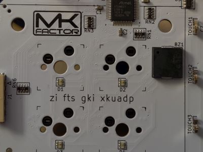

[XOR](https://defcon.org/signal/YourJourneyBegins/AlphabetShift/SandsSaharaAladdin/MC56F8006VLC/VendorSpeakerArtistCreatorHumanPressGoon/WatchYourHead/AlexisPark/SnowWhiteAndTheSevenDwarfs/ItWasTotallyAliens/XOR/)

We are presented with an image of the Declaration of Independence from the movie National Treasure. The code here is an Ottendorf Cipher. In the movie it decodes to the page - line - letter of a specific text.

Here we are given a Year - Page - Line - Word - Letter, and to decode, we use the DEFCON programs of years past. 

20-15-40-3-7 = DEFCON 20, Page 15, Line 40, Word 3, and Letter 7 = "e"

The DEFCON programs can be found on the media server.
* DEFCON 01 https://media.defcon.org/DEF%20CON%201/DEF%20CON%201%20program.pdf
* DEFCON 02 https://media.defcon.org/DEF%20CON%202/DEF%20CON%202%20program.pdf
* DEFCON 03 https://media.defcon.org/DEF%20CON%203/DEF%20CON%203%20program.pdf
* DEFCON 07 https://media.defcon.org/DEF%20CON%207/DEF%20CON%207%20program.pdf
* DEFCON 09 https://media.defcon.org/DEF%20CON%209/DEF%20CON%209%20program.pdf
* DEFCON 10 https://media.defcon.org/DEF%20CON%2010/DEF%20CON%2010%20program.pdf
* DEFCON 11 https://media.defcon.org/DEF%20CON%2011/DEF%20CON%2011%20program.pdf
* DEFCON 12 https://media.defcon.org/DEF%20CON%2012/DEF%20CON%2012%20program.pdf
* DEFCON 13 https://media.defcon.org/DEF%20CON%2013/DEF%20CON%2013%20Program.pdf
* DEFCON 14 https://media.defcon.org/DEF%20CON%2014/DEF%20CON%2014%20program.pdf
* DEFCON 15 https://media.defcon.org/DEF%20CON%2015/DEF%20CON%2015%20program.pdf
* DEFCON 16 https://media.defcon.org/DEF%20CON%2016/DEF%20CON%2016%20program.pdf
* DEFCON 17 https://media.defcon.org/DEF%20CON%2017/DEF%20CON%2017%20program.pdf
* DEFCON 18 https://media.defcon.org/DEF%20CON%2018/DEF%20CON%2018%20program.pdf
* DEFCON 19 https://media.defcon.org/DEF%20CON%2019/DEF%20CON%2019%20program.pdf
* DEFCON 20 https://media.defcon.org/DEF%20CON%2020/DEF%20CON%2020%20program.pdf
* DEFCON 21 https://media.defcon.org/DEF%20CON%2021/DEF%20CON%2021%20program.pdf
* DEFCON 22 https://media.defcon.org/DEF%20CON%2022/DEF%20CON%2022%20program.pdf
* DEFCON 23 https://media.defcon.org/DEF%20CON%2023/DEF%20CON%2023%20program.pdf
* DEFCON 24 https://media.defcon.org/DEF%20CON%2024/DEF%20CON%2024%20Program.pdf
* DEFCON 25 https://media.defcon.org/DEF%20CON%2025/DEF%20CON%2025%20program.pdf
* DEFCON 26 https://media.defcon.org/DEF%20CON%2026/DEF%20CON%2026%20program.pdf
* DEFCON 27 https://media.defcon.org/DEF%20CON%2027/DEF%20CON%2027%20program.pdf

After decoding all the letters, you get 

"emailthedecodedbottomboardtoyouhadtheanswerthewholetime@mkfactorcom"

Or, "email the decoded bottom board to 'youhadtheanswerthewholetime@mkfactor.com' "

Another vigenere encrypted message can be found inside the badge when taken apart:



```
zi fts gki xkuadp
```

This message also uses the same `DEFCON` key as the previous vigenere cipher and decodes to:

```
we are the signal
```
